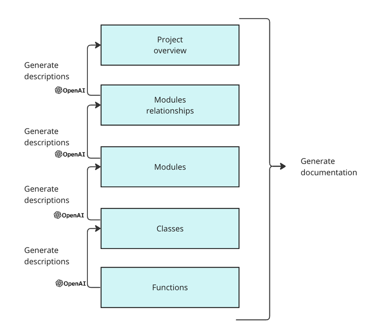

# pycodedoc

Welcome to pycodedoc, a Python tool leveraging generative AI to effortlessly document your Python projects.

- [pycodedoc](#pycodedoc)
  - [Demo](#demo)
  - [Features](#features)
      - [📚 AI-Generated Documentation](#-ai-generated-documentation)
      - [💻 CLI tool](#-cli-tool)
      - [🐍 Python API](#-python-api)
  - [How it works](#how-it-works)
  - [🛠️ Installation](#️-installation)
      - [Pypi](#pypi)
      - [Development](#development)
      - [Graphviz](#graphviz)
      - [OpenAI key](#openai-key)
  - [💻 CLI Usage](#-cli-usage)
      - [📁 Base directory](#-base-directory)
      - [💲 Cost of running the tool](#-cost-of-running-the-tool)
      - [🤖 Selecting a specific model](#-selecting-a-specific-model)
      - [🔖 Configuring prompts](#-configuring-prompts)
      - [📂 Output directory](#-output-directory)
      - [💾 Using code structure](#-using-code-structure)
      - [🔽 Reducing the documentation process](#-reducing-the-documentation-process)
  - [🐍 API Usage](#-api-usage)
      - [Generating full documentation](#generating-full-documentation)
      - [Generating part of the documentation](#generating-part-of-the-documentation)

## Demo


## Features

#### 📚 AI-Generated Documentation
Uses LLMs to automatically generate markdown documentation containing:
- an overview of the project as a whole, its main functionalities and its structure
- descriptions of the modules used in your project and how they interact with each other
- descriptions of the classes used throughout your project
- graphs showing the execution flow of your code

#### 💻 CLI tool
The CLI tool allows you to easily:
- modify the prompts you want to use for documenting your project
- use the OpenAI model of your choice
- estimate the costs of generating the documentation beforehand

#### 🐍 Python API
The library's API enables you to build on top of the tool

## How it works

The tool uses the OpenAI API to generate descriptions at different levels of detail within the project. The workflow it follows is outlined below:



Project documentation is generated using a bottom-up approach: it starts by generating descriptions of low-level entities in the codebase such as functions and classes before moving up to modules and their relationships until finally generating an overview of the project. The output from each step is used as context for the following step, **allowing the LLM to gain a gradual understanding of the overall codebase** as we move up the process.

## 🛠️ Installation

#### Pypi

```bash
pip install pycodedoc
```

#### Development

Alternatively to Pypi, you can clone the repository and install the package in editable mode :

```bash
git clone https://github.com/DivergerThinking/pycodedoc.git
cd pycodedoc
pip install -e .
```

#### Graphviz

To generate graphs showing the execution flows of your code we are using the [code2flow](https://github.com/scottrogowski/code2flow) python library which requires having graphviz. You can follow their documentation for installing the library on your corresponding OS: https://graphviz.org/download/, even though another very simple OS-free way of doing is to install it using conda: 

```bash
conda install graphviz
```

If you don't want to visualize your code's execution flow, you can ignore this step.

#### OpenAI key

Currently, the tool only supports OpenAI as a provider. To add your OpenAI key, export it as an environment variable via the terminal:

```bash
export OPENAI_API_KEY="..."
```

## 💻 CLI Usage

| Options               | Description                                                                                           |
|-----------------------|-------------------------------------------------------------------------------------------------------|
| `--base-dir` or `-d`   | The directory of the Python project you want to document.                                             |
| `--output-dir` or `-o` | The output directory path where the documentation is written. Default is "docs/".                                               |
| `--model` or `-m` | The OpenAI model to use for generating the documentation. Default is "gpt-3.5-turbo-0125".           |
| `--estimate` or `-e` | Prints estimation cost of generating the documentation. Default is False.                            |
| `--configure` or `-c` | Writes the defaults prompts to a prompt.toml file which can be modified. Default is False.                            |
| `--use-structure` or `-us` | Use the structure of the code to generate the documentation. Default is False.                      |
| `--no-relations` or `-nr` | Does not generate relationship between modules. Default is to generate them.                             |
| `--no-classes` or `-nc` | Does not generate classes descriptions. Default is to generate them.                                              |

#### 📁 Base directory

To run the tool you must specify the directory where your python project is found using the `--base-dir` or `-d` option. Ideally, all of your modules are stored in a single directory (ex. src/ directory). Here is an example on document the `pycodedoc` project itself.

```bash
pycodedoc -d src/pycodedoc
```

This will write the output to a markdown file under "./docs/project-doc.md". </br>
**NOTE**: Only Python files are used for documenting the project. 

#### 💲 Cost of running the tool

The cost of running the tool largely varies based on the size of the codebase and the model you use. To avoid bad surprises, you can first estimate the cost of running the tool by using the ``--estimate`` option:

```bash
pycodedoc -d src/pycodedoc --estimate
```

Running the tool on the ./src/pycodedoc/ directory approximately costs $0.01 if using the default configuration.

#### 🤖 Selecting a specific model

By default, the tool uses the latest ``gpt-3.5-turbo-0125`` model since it is currently the cheapest capable chat model from OpenAI.
You can however use another model by passing the model parameter using the ``--model`` or `-m` option

```bash
pycodedoc -d src/pycodedoc -m gpt-4-0125-preview
```

#### 🔖 Configuring prompts

The prompts used for documenting your codebase can be accessed and modified by using the `--configure` or `-c` option.

```bash
pycodedoc --configure
```

#### 📂 Output directory

By default, the documentation is stored under the /docs directory. If this directory is already in use and you want to avoid using it, you can modify the output directory with the `--output-dir` or `-o` option

```bash
pycodedoc -d src/pycodedoc --o project_docs
```

#### 💾 Using code structure

Instead of using the entire modules' content, you can only use the structure of the code (imports, signatures and function descriptions) via the `--use-structure` option. This is particularly useful if you have large files whose content may exceed the model's context window maximum token limit.

```bash
pycodedoc -d src/pycodedoc --use-structure
```

**NOTE**: the descriptions for each function in the files will be generated beforehand to make the code structure more meaningful while keeping the file's token count low. The cost of this process is (more or less) offset by the reduction in tokens from the resulting code structure.

#### 🔽 Reducing the documentation process

You can also reduce the documentation process by NOT generating descriptions for the classes or modules' relationships using the `--no-classes` and `--no-relations` options. 

```bash
pycodedoc -d src/pycodedoc --no-classes --no-relations
```

This reduces the overall context passed to the LLMs, reducing costs and speeding up the generation process. 

## 🐍 API Usage

You can build on top of the tool by using the main functions from the API.

#### Generating full documentation

The below code is the equivalent of running `pycodedoc` -d src/pycodedoc` using the CLI:

```python
from pycodedoc import DocGen

# to modify the prompts used, you can pass a dict reflecting the prompts.toml file to the `prompts=` argument
docgen = DocGen(base_dir="src/pycodedoc") # other configurations are the same as in the CLI
docgen.generate_documentation()
```

#### Generating part of the documentation

The `generate_descriptions` method can be used to generate descriptions at different levels of detail in the codebase. 

```python
from pycodedoc import DocGen

# to modify the prompts used, you can pass a dict reflecting the prompts.toml file to the `prompts=` argument
docgen = DocGen(base_dir="src/pycodedoc") # other configurations are the same as in the CLI
docgen.generate_descriptions("functions")
# OUTPUT -> list of descriptions for each function in the project
docgen.generate_descriptions("functions", module_path="parser.py")
# OUTPUT -> list of descriptions for the functions inside the parser.py module
docgen.generate_descriptions("classes")
# OUTPUT -> list of descriptions for each classes in the project
docgen.generate_descriptions("classes", module_path="parser.py")
# OUTPUT -> list of descriptions for the classes inside the parser.py module
docgen.generate_descriptions("modules")
# OUTPUT -> list of descriptions for each modules in the project
docgen.generate_descriptions("modules_relations")
# OUTPUT -> list of descriptions for each classes in the project
docgen.generate_descriptions("project")
# OUTPUT -> project description [str]. NOTE: first you need to generate the modules descriptions
```

Together, all of these steps make up for generating the overall project's documentation
